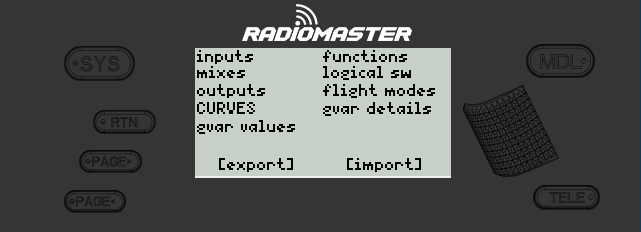

# EdgeTX ImpExp

Do you have multiple cars/planes (models)? Do you create custom curves, logical switches, functions (or other) and then want to easily move them between models? Do you resort to doing this task manually?

This is a simple on-transmitter lua script for importing / exporting the below of your model configuration.

 * Flight Modes
 * Global Variable Details (Name / Unit / Precision / Min / Max / Popup) - Depends on [this EdgeTX PR](https://github.com/EdgeTX/edgetx/pull/5688)
 * Global Variables Values (caveat loses flight mode inheritance)
 * Inputs
 * Mixes
 * Outputs
 * Curves
 * Logical Switches
 * Special Functions

## How to use:

### To Install

   1. Connect your transmitter to you computer
   1. Drop the ImpExp.lua file in SCRIPTS/TOOLS
   1. Disconnect transmitter from computer

### To use

   1. Go back to main screen (RTN key?)
   1. To to System (SYS key?)
   1. Navigate to ImpExp
   1. Export what you want to transfer
   1. Switch model (MDL key etc)
   1. Go back to main screen (RTN key?)
   1. To to System (SYS key?)
   1. Navigate to ImpExp
   1. Import what you want to transfer
